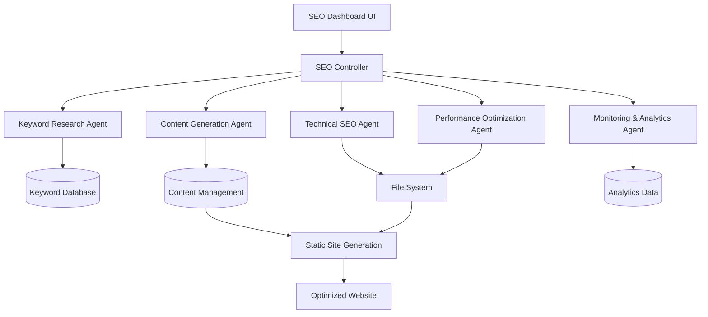

# AI-Driven SEO Optimization System Design

## Overview

This system implements a comprehensive AI-driven SEO optimization platform that automates the entire SEO workflow from keyword research to performance optimization. The architecture follows a modular, agent-based approach where specialized AI agents handle different aspects of SEO optimization in parallel, creating a scalable and efficient system that can rapidly improve search rankings and drive revenue.

The system integrates with the existing Next.js application and extends the current content management structure to support dynamic, AI-generated landing pages while maintaining the existing article system.

## Architecture

### High-Level Architecture



### Agent-Based Processing Model

The system employs multiple specialized AI agents that can work in parallel:

1. **Keyword Research Agent**: Analyzes business context and generates strategic keyword lists
2. **Content Generation Agent**: Creates comprehensive, localized landing pages
3. **Technical SEO Agent**: Performs diagnostics and implements technical fixes
4. **Performance Optimization Agent**: Handles speed and Core Web Vitals optimization
5. **Monitoring & Analytics Agent**: Tracks performance and suggests optimizations

## Components and Interfaces

### 1. SEO Controller Service

**Location**: `src/services/seo/SEOController.ts`

```typescript
interface SEOController {
  // Orchestrates the entire SEO optimization workflow
  optimizeWebsite(config: SEOOptimizationConfig): Promise<SEOOptimizationResult>
  
  // Manages parallel agent execution
  executeAgents(agents: SEOAgent[], tasks: SEOTask[]): Promise<AgentResult[]>
  
  // Coordinates feedback loops and continuous optimization
  startContinuousOptimization(): Promise<void>
}

interface SEOOptimizationConfig {
  websiteUrl: string
  businessDescription: string
  targetLocations?: string[]
  focusKeywords?: string[]
  optimizationLevel: 'basic' | 'comprehensive' | 'aggressive'
}
```

### 2. Keyword Research Agent

**Location**: `src/services/seo/agents/KeywordResearchAgent.ts`

```typescript
interface KeywordResearchAgent extends SEOAgent {
  analyzeWebsite(url: string, businessContext: string): Promise<WebsiteAnalysis>
  generateKeywords(analysis: WebsiteAnalysis): Promise<KeywordSet>
  categorizeKeywords(keywords: string[]): Promise<CategorizedKeywords>
  prioritizeByIntent(keywords: CategorizedKeywords): Promise<PrioritizedKeywords>
}

interface CategorizedKeywords {
  emergency: string[]
  service: string[]
  problem: string[]
  local: string[]
  commercial: string[]
}
```

### 3. Content Generation Agent

**Location**: `src/services/seo/agents/ContentGenerationAgent.ts`

```typescript
interface ContentGenerationAgent extends SEOAgent {
  generateLandingPage(keyword: string, location?: string): Promise<LandingPageContent>
  enrichWithLocalContext(content: LandingPageContent, location: string): Promise<LandingPageContent>
  optimizeForSEO(content: LandingPageContent): Promise<OptimizedContent>
  generateSchemaMarkup(content: LandingPageContent): Promise<SchemaMarkup>
}

interface LandingPageContent {
  title: string
  description: string
  content: string
  headings: HeadingStructure[]
  localReferences: LocalReference[]
  faqSection: FAQ[]
  callToAction: CTA[]
}
```

### 4. Technical SEO Agent

**Location**: `src/services/seo/agents/TechnicalSEOAgent.ts`

```typescript
interface TechnicalSEOAgent extends SEOAgent {
  auditWebsite(): Promise<TechnicalSEOAudit>
  fixRobotsTxt(): Promise<void>
  generateSitemap(): Promise<void>
  implementSchemaMarkup(pages: PageData[]): Promise<void>
  optimizeMobileCompatibility(): Promise<void>
  fixCrawlabilityIssues(): Promise<void>
}

interface TechnicalSEOAudit {
  robotsTxtIssues: Issue[]
  sitemapIssues: Issue[]
  schemaMarkupMissing: string[]
  mobileCompatibilityIssues: Issue[]
  crawlabilityIssues: Issue[]
  loadingSpeedIssues: Issue[]
}
```

### 5. Performance Optimization Agent

**Location**: `src/services/seo/agents/PerformanceOptimizationAgent.ts`

```typescript
interface PerformanceOptimizationAgent extends SEOAgent {
  analyzePageSpeedInsights(url: string): Promise<PageSpeedAnalysis>
  optimizeImages(): Promise<ImageOptimizationResult>
  minifyAssets(): Promise<AssetOptimizationResult>
  implementCaching(): Promise<CachingOptimizationResult>
  optimizeCoreWebVitals(): Promise<CoreWebVitalsResult>
}
```

### 6. Dynamic Content Management System

**Location**: `src/services/content/DynamicContentManager.ts`

Extends the existing content system to support AI-generated pages:

```typescript
interface DynamicContentManager {
  createLandingPage(keyword: string, content: LandingPageContent): Promise<string>
  updateSitemap(newPages: string[]): Promise<void>
  generatePageMetadata(content: LandingPageContent): Promise<PageMetadata>
  validateContentQuality(content: LandingPageContent): Promise<QualityScore>
}
```

## Data Models

### Keyword Data Model

```typescript
interface Keyword {
  id: string
  term: string
  category: KeywordCategory
  intent: SearchIntent
  difficulty: number
  volume: number
  commercialValue: number
  localRelevance?: number
  priority: number
  targetLocation?: string
}

enum KeywordCategory {
  EMERGENCY = 'emergency',
  SERVICE = 'service',
  PROBLEM = 'problem',
  LOCAL = 'local',
  COMMERCIAL = 'commercial'
}

enum SearchIntent {
  INFORMATIONAL = 'informational',
  NAVIGATIONAL = 'navigational',
  TRANSACTIONAL = 'transactional',
  COMMERCIAL = 'commercial'
}
```

### Landing Page Data Model

```typescript
interface LandingPage {
  id: string
  slug: string
  keyword: Keyword
  title: string
  description: string
  content: string
  metadata: PageMetadata
  schemaMarkup: SchemaMarkup
  localContext?: LocalContext
  performance: PerformanceMetrics
  createdAt: Date
  updatedAt: Date
  status: PageStatus
}

interface LocalContext {
  location: string
  landmarks: string[]
  culturalReferences: string[]
  localFactors: string[]
  demographics: Demographics
}
```

### Performance Tracking Model

```typescript
interface PerformanceMetrics {
  pageId: string
  rankings: KeywordRanking[]
  traffic: TrafficMetrics
  conversions: ConversionMetrics
  coreWebVitals: CoreWebVitals
  lastUpdated: Date
}

interface KeywordRanking {
  keyword: string
  position: number
  url: string
  searchEngine: string
  location?: string
  date: Date
}
```

## Error Handling

### Agent Error Recovery

```typescript
interface AgentErrorHandler {
  handleAgentFailure(agent: SEOAgent, error: Error): Promise<RecoveryAction>
  retryWithBackoff(operation: () => Promise<any>, maxRetries: number): Promise<any>
  fallbackToManualProcess(task: SEOTask): Promise<ManualProcessResult>
}

enum RecoveryAction {
  RETRY = 'retry',
  FALLBACK = 'fallback',
  SKIP = 'skip',
  MANUAL_INTERVENTION = 'manual'
}
```

### Content Quality Validation

```typescript
interface ContentValidator {
  validateSEOOptimization(content: LandingPageContent): ValidationResult
  checkForDuplicateContent(content: string): DuplicateCheckResult
  validateLocalReferences(content: LandingPageContent, location: string): LocalValidationResult
  ensureReadability(content: string): ReadabilityScore
}
```

## Testing Strategy

### Unit Testing

- **Agent Testing**: Each SEO agent will have comprehensive unit tests covering all methods
- **Content Generation Testing**: Validate generated content quality, uniqueness, and SEO optimization
- **Performance Testing**: Test optimization algorithms and measure improvement metrics
- **Integration Testing**: Test agent coordination and parallel processing

### End-to-End Testing

- **Full Workflow Testing**: Test complete SEO optimization pipeline from keyword research to performance optimization
- **Performance Validation**: Measure actual PageSpeed Insights improvements
- **Ranking Simulation**: Test keyword ranking improvements using controlled environments

### Quality Assurance

- **Content Quality Metrics**: Implement automated scoring for generated content
- **SEO Compliance Checking**: Validate all technical SEO implementations
- **Performance Benchmarking**: Establish baseline metrics and track improvements

### Testing Tools and Frameworks

```typescript
// Example test structure
describe('KeywordResearchAgent', () => {
  test('should generate categorized keywords for business context', async () => {
    const agent = new KeywordResearchAgent()
    const result = await agent.generateKeywords({
      websiteUrl: 'https://example.com',
      businessDescription: 'Emergency truck repair service'
    })
    
    expect(result.emergency).toContain('emergency truck repair')
    expect(result.local).toContain('truck repair near me')
    expect(result.service).toContain('mobile truck mechanic')
  })
})
```

## Implementation Phases

### Phase 1: Core Infrastructure
- Set up agent-based architecture
- Implement SEO Controller
- Create basic keyword research capabilities

### Phase 2: Content Generation
- Implement Content Generation Agent
- Extend existing content management system
- Add dynamic landing page creation

### Phase 3: Technical Optimization
- Implement Technical SEO Agent
- Add automated diagnostics and fixes
- Integrate with existing Next.js build process

### Phase 4: Performance & Monitoring
- Implement Performance Optimization Agent
- Add continuous monitoring capabilities
- Create feedback loops for optimization

### Phase 5: Advanced Features
- Add multi-agent parallel processing
- Implement advanced local SEO features
- Create comprehensive analytics dashboard